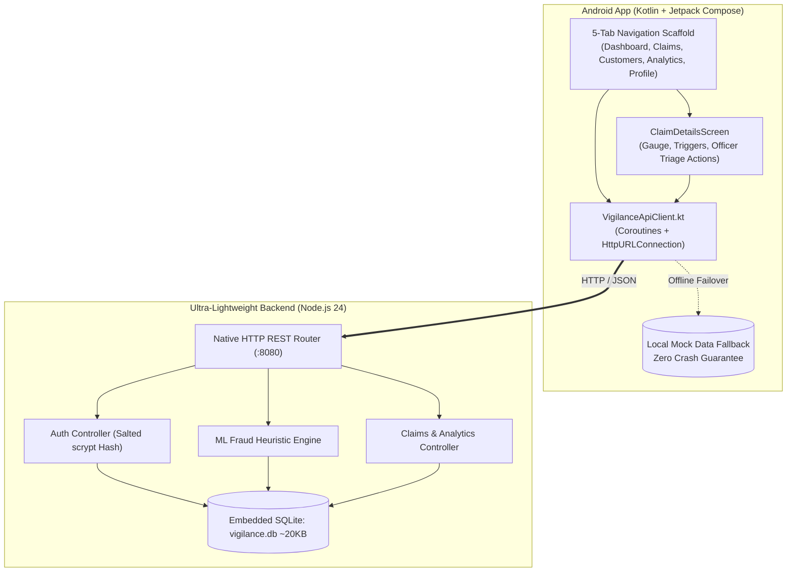

# Vigilance Insurtech — ML Insurance Fraud Detection System

[](https://developer.android.com)
[](https://kotlinlang.org)
[](https://developer.android.com/jetpack/compose)
[](https://nodejs.org)
[](https://sqlite.org)
[](#ultra-low-disk-footprint)
[](#license)

**Vigilance Insurtech** is an enterprise-grade forensic decision-support mobile application and RESTful backend designed for insurance fraud investigators, claims adjusters, and risk underwriters. It pairs a **Material Design 3 (M3)** native Android client with an ultra-lightweight, zero-dependency **Node.js** scoring backend.

---

## Architecture Overview



---

## Key Features

- **Automated ML Fraud Risk Scoring**: Real-time heuristic scoring engine evaluating claim amount thresholds, missing police FIR/CCTV flags, late-night incident timing, and recent policy purchases (<90 days).
- **Material 3 Enterprise Design ("Vigilance Insurtech M3")**:
  - **Dashboard**: High-density 2x2 operational KPI grid, 6-month anomaly trend chart, risk tier distribution bar, and prioritized suspicious claims queue.
  - **Claims Audit Queue**: Real-time searchable claims list with dynamic filtering (High, Medium, Low Risk, Under Review, Approved).
  - **Claim Deep-Dive**: Circular risk probability gauge, factor breakdown, investigation notes, and live decision actions (`Approve`, `Investigate`, `Flag`).
  - **Customer Management**: Policyholder risk portfolio tracking claims count and aggregate claim amounts.
  - **Forensic Analytics**: Real-time fraud prevention savings metrics (₹), model precision benchmarks (96.4%), triage latency, and incident category distributions.
- **Ultra-Low Disk Footprint**:
  - **Backend**: Entire server folder takes **~54 KB total** on disk with **0 external npm packages** (built using native `node:http` and Node 24's built-in `node:sqlite`).
  - **Android Client**: Uses built-in `HttpURLConnection` and `org.json` with coroutines, adding **0 KB of third-party library bloat** to the APK.
- **Enterprise Security Hardening**:
  - Salted cryptographic password hashing via `scrypt` with constant-time verification.
  - Strict input whitelist validation on triage state transitions.
  - Android `network_security_config.xml` locking cleartext traffic strictly to local loopbacks (`10.0.2.2`, `127.0.0.1`, `localhost`).
  - Parameterized SQLite queries preventing SQL Injection (SQLi).
  - Unrestricted payload throughput for high-resolution accident photos, police reports, and PDFs.

---

## Prerequisites

Before running the project, ensure you have:

1. **Node.js**: Version **v22+** or **v24+** (v24.14+ recommended for built-in `node:sqlite`).
   - Check with: `node -v`
2. **Android Studio**: Android Studio Ladybug / Koala or newer with:
   - Android SDK Platform **36** (or 34+)
   - Android Virtual Device (AVD) (e.g., **Pixel 8**) or physical Android phone with USB debugging.
3. **Java Development Kit (JDK)**: JDK 17, 21, or 22.
   - Check with: `java -version`

---

## Installation & Setup

### 1. Clone the Repository
```bash
git clone https://github.com/ardy644/InsuranceFraudApp.git
cd InsuranceFraudApp
```

### 2. Verify Backend Setup
No `npm install` is required! The backend uses 100% native Node.js standard modules.
```bash
# Test starting the backend
node backend/server.js
```
You should see:
```text
====================================================
🛡️  Vigilance Insurtech ML Risk Server active!
📍 Listening on: http://127.0.0.1:8080
📱 Android Emulator URL: http://10.0.2.2:8080
💽 Database: .../backend/vigilance.db
====================================================
```
Press `Ctrl + C` to stop it when done testing.

### 3. Build the Android Application
Open terminal in the project root:
```bash
# On Windows PowerShell:
.\gradlew.bat assembleDebug

# On macOS / Linux:
./gradlew assembleDebug
```
The compiled debug APK will be generated at:
`app/build/outputs/apk/debug/app-debug.apk`

---

## How to Run the Complete System

### Step 1: Start the Backend Server
Keep a terminal open and run:
```powershell
node backend/server.js
```
> *Leave this terminal window running so the server can accept requests from the mobile app.*

---

### Step 2: Launch the Android App

#### Option A: Running from Android Studio (Recommended)
1. Launch **Android Studio**.
2. Select **Open** and choose the `InsuranceFraudApp` folder.
3. Wait for Gradle sync to complete.
4. Select your device/emulator (e.g. **Pixel 8**) in the device dropdown.
5. Click the green ▶️ **Run** button (or press `Shift + F10`).
6. On the login screen, enter:
   - **Email**: `aryan@vigilance.ai`
   - **Password**: `admin123`
7. Click **Login** to enter the live forensic dashboard.

#### Option B: Running purely from Command Line
In a **second** terminal window:

1. **Boot the Android Emulator:**
   ```powershell
   & "$env:LOCALAPPDATA\Android\Sdk\emulator\emulator.exe" -avd Pixel_8
   ```
   *(Wait ~30 seconds for the virtual device to reach the home screen)*

2. **Install the APK:**
   ```powershell
   & "$env:LOCALAPPDATA\Android\Sdk\platform-tools\adb.exe" install -r "app\build\outputs\apk\debug\app-debug.apk"
   ```

3. **Launch the Application:**
   ```powershell
   & "$env:LOCALAPPDATA\Android\Sdk\platform-tools\adb.exe" shell am start -n com.example.insurancefraudapp/.MainActivity
   ```

---

## REST API Documentation

The backend listens on port `8080` (accessible from Android Emulators via loopback alias `http://10.0.2.2:8080`).

| Method | Endpoint | Description |
| :--- | :--- | :--- |
| `GET` | `/api/health` | Server health check, uptime, engine metadata |
| `POST` | `/api/auth/login` | Officer authentication with salted `scrypt` password verification |
| `GET` | `/api/dashboard/stats` | Operational KPIs, risk tier breakdown, 6-month anomaly trends |
| `GET` | `/api/claims` | List claims (`?filter=suspicious`, `?status=...`, `?search=...`) |
| `GET` | `/api/claims/:id` | Retrieve single claim details |
| `POST` | `/api/claims` | Submit new claim + triggers automated heuristic ML risk assessment |
| `PATCH` | `/api/claims/:id/status` | Update claim decision (`Approved`, `Under Investigation`, `Flagged`, `Rejected`) |
| `POST` | `/api/claims/analyze` | Standalone fraud risk analysis (computes score & detects anomalies) |
| `GET` | `/api/customers` | Retrieve customer portfolio and risk tiers |
| `GET` | `/api/analytics` | Forensic audit statistics, savings metrics, category breakdown |

### Sample Payload: Analyze Claim
```bash
curl -X POST http://127.0.0.1:8080/api/claims/analyze \
  -H "Content-Type: application/json" \
  -d '{"claimAmount": 2200000, "description": "Accident at midnight without police FIR filed within 48 hours of policy inception"}'
```
**Response:**
```json
{
  "fraudRiskScore": 98,
  "riskCategory": "High",
  "riskFactors": [
    "Extreme claim amount (>₹20L)",
    "No police FIR filed",
    "Late night incident window",
    "Recent policy purchase / alteration (<90 days)"
  ],
  "recommendation": "Escalate to SIU investigation immediately"
}
```

---

## Project Structure

```text
InsuranceFraudApp/
├── app/                                 # Native Android Jetpack Compose Module
│   ├── src/main/
│   │   ├── AndroidManifest.xml          # Permissions & Network Security Config
│   │   ├── java/com/example/insurancefraudapp/
│   │   │   ├── MainActivity.kt          # 5-Tab Navigation Scaffold
│   │   │   ├── Navigation.kt            # NavHost routing logic
│   │   │   ├── DashboardScreen.kt       # Live operational dashboard
│   │   │   ├── ClaimDetailsScreen.kt    # Deep dive & decision actions
│   │   │   ├── ClaimsListScreen.kt      # Dynamic claims queue & search
│   │   │   ├── CustomersListScreen.kt   # Policyholder portfolio
│   │   │   ├── AnalyticsScreen.kt       # ML analytics & charts
│   │   │   ├── SettingsScreen.kt        # Officer profile & settings
│   │   │   ├── LoginScreen.kt           # Authentication screen
│   │   │   ├── Claim.kt                 # Domain data models & seeds
│   │   │   ├── network/
│   │   │   │   └── VigilanceApiClient.kt# Zero-dependency networking layer
│   │   │   └── ui/theme/                # Vigilance Insurtech M3 Color & Type
│   │   └── res/xml/
│   │       └── network_security_config.xml # Local loopback cleartext whitelist
├── backend/                             # Ultra-low footprint Node.js Backend (~54 KB)
│   ├── server.js                        # Native HTTP server + SQLite + ML engine
│   ├── package.json                     # Metadata ("type": "module")
│   ├── README.md                        # Backend specific documentation
│   └── vigilance.db                     # Embedded SQLite database (auto-created)
├── build.gradle.kts                     # Root build configuration
├── PROJECT_STATE.md                     # Project milestones & checklist
└── README.md                            # Main project documentation
```

---

## License

This project is licensed under the [MIT License](LICENSE).
